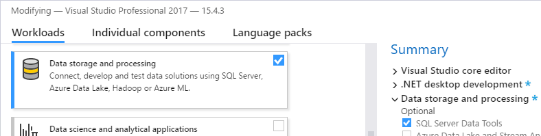

# SSDT
Sql Server Data Tools (SSDT) provides a database project for managing Sql Server Databases. To my knowledge, it only supports Sql Server (or Azure variants thereof).
SSDT appears to be available with any valid Visual Studio license, including Community Edition.

These notes are based on Visual Studio 2017 version 15.4.3 and SSDT version 15.1.61707.200 on Windows 10.

# Installing SSDT
There are several different ways to get SSDT, including downloading directly from Microsoft.com [Download SQL Server Data Tools (SSDT)](https://docs.microsoft.com/en-us/sql/ssdt/download-sql-server-data-tools-ssdt). Note that this page may include preview versions.

However, in my experience the most reliable means to get SSDT is to use the Visual Studio 2017 installer. If you already have Visual Studio 2017 installed, one way to launch it is to:
 * go to "Apps and Features"
 * locate the entry for "Microsoft Visual Studio 2017"
 * click "Modify"
 * Once the visual studio installer launches, select the product you have installed, and click "Modify".  You should then be presented with "workloads".

 Alternately, just re-downloading the Visual Studio 2017 installer and launching it should also work.

 Once you have "workloads" up:
  * Select the "Data storage and processing" workload
  * Then select "Sql Server Data Tools"
  

# Importing a database with SSDT
If you already have a database that you now want to bring into SSDT, you can easily import its schema into a database project.  This provides several advantages including easy integration with source control and database object validity checks - we will explore these in more detail later.

To import a database schema into a new project you can use the following steps:
 1. Create a new database project 
 1. Right-click the database project, choose "Import" and "Database" 
 1. Fill out the database connection, choose the import options, and click start 
	* Note: There are several different options for the default structure of the files in the imported project.  I generally prefer "Schema\Object", but afterwards manually move the schema create script under each schema folder.  SSDT actually doesn't care how the files are structured - it only requires that the create scripts be valid.
 1. You now have a database project that you can commit to source control, just like any other source code.  With the import options shown in the previous screen shot, Schemas will be under the "Security" folder, and each object will be in a folder corresponding to the schema name with sub-folders per "major" db object type. Again, you can re-arrange folder structures however you wish.
 
 1. Note: while selecting "Import Database Settings" should set default options to match the setting from your imported database, it is a good idea to verify the project database settings, especially collation and ansi settings. Generally speaking it's probably a good idea to uncheck ["auto-close"](https://www.brentozar.com/blitz/auto-close-enabled/) on the "Operational tab". To do so, right click the project in solution explorer, click "properties" and open the database settings. Make desired changes, save all on the solution and commit your changes to source control. The settings are stored in the .sqlproj file.
 
 1. Note: While the project settings correspond to database settings, just like SQL Server objects can have different ansi settings then the db default, so this can also occur with the SSDT project, e.g. 

# Building database projects
You build SSDT database projects, just like any other source code in visual studio (e.g. by buildling the project or the solution).

One of the advantages of SSDT is that if you, for example, reference an object that doesn't exist, the build will fail (in most cases), letting you know that something is wrong.
For example, suppose I mistype a column in a stored procedure definition, I would see an error similar to 

If I for example, type a column such that it differs only by case, I will get a warning similar to .

Optionally, I can treat all tsql warnings as errors: 

Or suppress warnings globally: 

Or suppress warnings per file:  

Finally, SSDT also includes several built-in code analysis rules for sql, which you can enable:  

# Extended Properties (and data dictionary)
SSDT provides limited built-in support for data dictionary entries on table columns.
To enable ui editing, you must right click the column headers and select "Description", e.g.  

Then you can see and edit from either the extended property in the sql script or the "Description" field in the table designer:  
 

Note that even if you don't have "Description" enabled in the designer, you can still edit the extended property - they are one and the same.

Also of note:
 * The UI designer (as far as I can tell) will not accept newlines for editing in the designer.  However, 
 if you put a newline in the extended property definition, the designer will show it.
 * It appears that SSDT only provides the UI description for table columns.  However, you can still
 add extended properties via script to any legal database object, and they will be stored and show up
 in schema comparison.
 * There are tools (such as from redgate) that will generate data dictionaries from the ms_description extended properties, including those on stored procedures that you would store in SSDT.
 * You could fairly easily write a basic html/text/csv etc data dictionary by querying the extended properties yourself for which e.g. [sys.fn_listextendedproperty](https://docs.microsoft.com/en-us/sql/relational-databases/system-functions/sys-fn-listextendedproperty-transact-sql) might be helpful
 * While the SSDT designer only provides support for ms_description property, you can store any valid extended property in the .sql file for the object.

# Schema Comparison and Syncing

# Refactor Log

# SSDT Variables and Sql Command

# Database References

# "End State" Deployment and data management

# Generating Scripts with Publish

# Generating Scripts with Schema Compare

# Publishing with dacpac

# Column Ordering

# A note on source control

# Integrating with automated builds

# A note on EF / ORM syncing

# Pre and Post deployment scripts

# Sql Server CLR

# Data Comparison

# Static Data